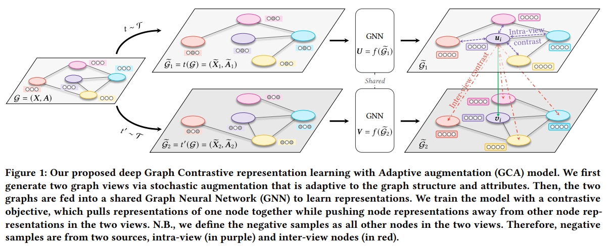

复现相关问题：与ProGCL环境类似，只需额外安装nni库。项目使用python3.7.4。
原作者环境配置不太准确，
推荐使用以下命令配置环境。
```
pip install torch==1.7.0+cu110 -f https://download.pytorch.org/whl/torch/
pip install torch_geometric==1.7.0
pip install torch-cluster==1.5.9 torch-scatter==2.0.7 torch-sparse==0.6.9 torch-spline-conv==1.2.1 -f https://pytorch-geometric.com/whl/torch-1.7.0%2Bcu110.html
pip install pyyaml ogb nni
```
同时使用conda或者apt-get获取cuda toolkit 11.0
```
apt-get install -y cuda-toolkit-11-0
```
对本文加入的PSGCL方法，还需要安装imblearn库。
同时imblearn对python3.7的支持不是很好，安装后报错部分把imblearn对应的 '/' 删除即可运行。
```
pip install imblearn
```

以下是原作者的README.md

---

# GCA



This is the code for the WWW 2021 Paper: [Graph Contrastive Learning with Adaptive Augmentation](https://dl.acm.org/doi/abs/10.1145/3442381.3449802).

## Usage

For example, to run GCA-Degree under WikiCS, execute:
```
python train.py --device cuda:0 --dataset WikiCS --param local:wikics.json --drop_scheme degree
```

## Requirements


## Citation

Please cite our paper if you use the code:
```
@inproceedings{zhu2021graph,
  title={Graph contrastive learning with adaptive augmentation},
  author={Zhu, Yanqiao and Xu, Yichen and Yu, Feng and Liu, Qiang and Wu, Shu and Wang, Liang},
  booktitle={Proceedings of the Web Conference 2021},
  pages={2069--2080},
  year={2021}
}
```


